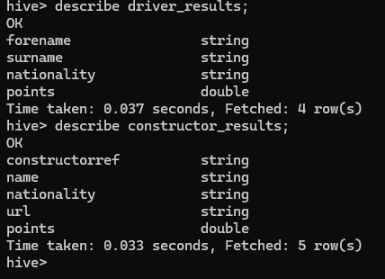
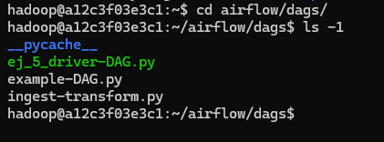
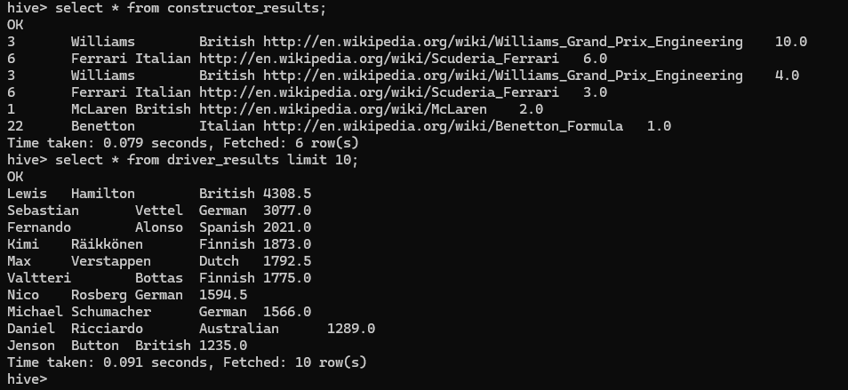

# Ejercicios

Consigna: Por cada ejercicio, escribir el código y agregar una captura de pantalla del resultado obtenido.

Diccionario de datos:

https://www.kaggle.com/datasets/rohanrao/formula-1-world-championship-1950-2020?select=results.csv


## Ejercicio 1. 

Crear la siguientes tablas externas en la base de datos f1 en hive:

a). driver_results (driver_forename, driver_surname, driver_nationality, points).


b). constructor_results (constructorRef, cons_name, cons_nationality, url, points).


```js
    a). driver_results (driver_forename, driver_surname, driver_nationality, points)


CREATE EXTERNAL TABLE formula1.driver_results(forename STRING, surname STRING, nationality STRING, points DOUBLE)
COMMENT 'Formula1 Driver Results table'
ROW FORMAT DELIMITED
FIELDS TERMINATED BY ','
LOCATION '/tables/external/formula1/driver_results';

```
```js
    b). constructor_results (constructorRef, cons_name, cons_nationality, url, points)


CREATE EXTERNAL TABLE formula1.constructor_results(constructorRef STRING, name STRING, nationality STRING, url STRING, points DOUBLE)
COMMENT 'Formula1 Constructor Results table'
ROW FORMAT DELIMITED
FIELDS TERMINATED BY ','
LOCATION '/tables/external/formula1/constructor_results';

```


## Ejercicio 2.

 En Hive, mostrar el esquema de driver_results y constructor_results.

    describe driver_results;

    describe constructor_results;



 ## Ejercicio 3. 
 
 Crear un archivo .bash que permita descargar los archivos mencionados abajo e
ingestarlos en HDFS:

```js
    results.csv

    https://dataengineerpublic.blob.core.windows.net/data-engineer/f1/results.csv


    drivers.csv

    https://dataengineerpublic.blob.core.windows.net/data-engineer/f1/drivers.csv

    constructors.csv

    https://dataengineerpublic.blob.core.windows.net/data-engineer/f1/constructors.csv

    races.csv

    https://dataengineerpublic.blob.core.windows.net/data-engineer/f1/races.csv
```
## formula.sh

```sh
hadoop@a12c3f03e3c1:~/scripts$ cat > formula.sh
rm -f /home/hadoop/landing/*

wget -P /home/hadoop/landing  https://dataengineerpublic.blob.core.windows.net/data-engineer/f1/results.csv

wget -P /home/hadoop/landing  https://dataengineerpublic.blob.core.windows.net/data-engineer/f1/drivers.csv

wget -P /home/hadoop/landing  https://dataengineerpublic.blob.core.windows.net/data-engineer/f1/constructors.csv

wget -P /home/hadoop/landing https://dataengineerpublic.blob.core.windows.net/data-engineer/f1/races.csv

/home/hadoop/hadoop/bin/hdfs dfs -rm -f /ingest/*

```
```sh
hadoop@a12c3f03e3c1:~/scripts$ chmod 777 formula.sh
hadoop@a12c3f03e3c1:~/scripts$ ./formula.sh
```

## Ejercicio 4. 

Generar un archivo .py que permita, mediante Spark:

### a). insertar en la tabla driver_results los corredores con mayor cantidad de puntos en la historia.

#### Archivo transformation_driver.py
```sh
from pyspark.context import SparkContext
from pyspark.sql.session import SparkSession
from pyspark.sql import HiveContext
sc = SparkContext('local')
spark = SparkSession(sc)
hc = HiveContext(sc)


df = spark.read.option("header", "true").csv("hdfs://172.17.0.2:9000/ingest/drivers.csv")
df.createOrReplaceTempView("view_driver")
new_df = spark.sql("select cast(driverId as int), forename, surname, nationality  from view_driver ")


df1 = spark.read.option("header", "true").csv("hdfs://172.17.0.2:9000/ingest/results.csv")
df1.createOrReplaceTempView("view_results")
new_df1 = spark.sql("select cast(driverId as int), cast(points as float) from view_results ")
new_df1.createOrReplaceTempView("view_1")
new_df2 = spark.sql("select driverId, sum(points) as total_points from view_1 group by driverId order by total_points desc limit 10")


new_df.createOrReplaceTempView("view_driver_final")
new_df2.createOrReplaceTempView("view_result_final")

df_driver = spark.sql("select * from view_driver_final")
df_result = spark.sql("select * from view_result_final")


df_final = df_driver.join(df_result, on="driverId", how="inner")

df_final.createOrReplaceTempView("viaje_final")
df_f = spark.sql("select forename, surname, nationality, total_points from viaje_final order by total_points desc")

df_f .createOrReplaceTempView("viaje_final1")
spark.sql("insert into formula1.driver_results select* from viaje_final1")

```


b). insertar en la tabla constructor_result quienes obtuvieron más puntos en el
Spanish Grand Prix en el año 1991.

#### Archivo transformation_constructors.py
```sh
from pyspark.context import SparkContext
from pyspark.sql.session import SparkSession
from pyspark.sql import HiveContext
sc = SparkContext('local')
spark = SparkSession(sc)
hc = HiveContext(sc)


constructors_df = spark.read.option("header", "true").csv("hdfs://172.17.0.2:9000/ingest/constructors.csv")
races_df = spark.read.option("header", "true").csv("hdfs://172.17.0.2:9000/ingest/races.csv")
results_df = spark.read.option("header", "true").csv("hdfs://172.17.0.2:9000/ingest/results.csv")


constructors_df.createOrReplaceTempView("constructors")
races_df.createOrReplaceTempView("races")
results_df.createOrReplaceTempView("results")

SpanishGP = spark.sql("""
    SELECT 
        CAST(c.constructorId AS STRING) AS constructor_ref, 
        CAST(c.name AS STRING) AS cons_name, 
        CAST(c.nationality AS STRING) AS cons_nationality, 
        CAST(c.url AS STRING) AS url,
        SUM(CAST(r.points AS DOUBLE)) AS points
    FROM constructors c
    INNER JOIN results r ON c.constructorId = r.constructorId
    INNER JOIN races ra ON ra.raceId = r.raceId
    WHERE ra.name = 'Spanish Grand Prix' 
      AND ra.year = 1991 
      AND r.points != 0
    GROUP BY c.constructorId, c.constructorRef, c.name, c.nationality, c.url
    ORDER BY points DESC
""")


SpanishGP.write.mode("overwrite").saveAsTable("formula1.constructor_results")


```

## Ejercicio 5.

 Realizar un proceso automático en Airflow que orqueste los archivos creados en los
puntos 3 y 4. Correrlo y mostrar una captura de pantalla (del DAG y del resultado en la base de datos)





## DAG

Archivo  ej_5_driver-DAG.py

```
from datetime import timedelta
from airflow import DAG
from airflow.operators.bash import BashOperator
from airflow.operators.dummy import DummyOperator
from airflow.utils.dates import days_ago
from airflow.utils.task_group import TaskGroup


args = {
    'owner': 'airflow',
}

with DAG(
    dag_id='formula1-DAG',
    default_args=args,
    schedule_interval='0 0 * * *',
    start_date=days_ago(2),
    dagrun_timeout=timedelta(minutes=60),
    tags=['ingest', 'transform'],
    params={"example_key": "example_value"},
) as dag:

    comienza_proceso = DummyOperator(
        task_id='comienza',
    )
	

    finaliza_proceso = DummyOperator(
        task_id='finaliza',
    )

    ingest = BashOperator(
        task_id='ingest',
        bash_command='/usr/bin/sh /home/hadoop/scripts/formula.sh ',
    )

    with TaskGroup('Transform') as Transform:
        transform_drivers = BashOperator(
        task_id='transform_drivers',
        bash_command='ssh hadoop@172.17.0.2 /home/hadoop/spark/bin/spark-submit --files /home/hadoop/hive/conf/hive-site.xml /home/hadoop/scripts/transformation_driver.py ',
    )
        transform_constructors = BashOperator(
        task_id='transform_constructors',
        bash_command='ssh hadoop@172.17.0.2 /home/hadoop/spark/bin/spark-submit --files /home/hadoop/hive/conf/hive-site.xml /home/hadoop/scripts/transformation_constructors.py ',
    )
  

    comienza_proceso >> ingest >> Transform >> finaliza_proceso


if __name__ == "__main__":
    dag.cli()

```


